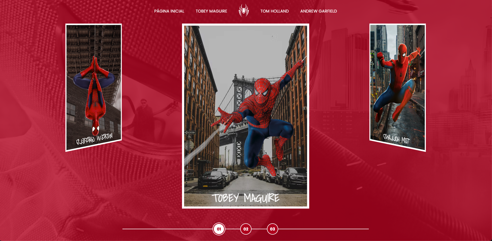

<h1>Spide-Man By Rafael Ribeiro</h1>

## What is this project

## Project Spider-Man Multiverse

Project to train my skills in front-end, also to fulfill the final project of the course. The main function of this project is the development of a carousel in JS, emphasizing knowledge in the X, Y and Z axes

## Project development

 
- [✓] HTML
 
- [✓] CSS
 
- [✓] JS
 
- [✓] I also used a JS library called Fancybox

